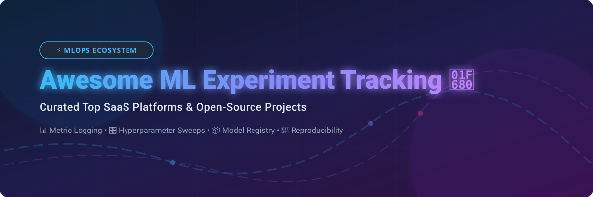

  
  
  
  
  

# 🚀 Awesome ML Experiment Tracking & MLOps Ecosystem

> 📌 **Curated index of SaaS platforms and open-source GitHub projects for Machine Learning & Deep Learning experiment tracking, metric logging, hyperparameter sweeps, model registries, and reproducibility.**

*Last updated: September 2026*

---

## 🔍 Overview & Key Capabilities

In modern **Machine Learning (ML)** and **Deep Learning (DL)** workflows, systematic **experiment tracking** is critical for reproducibility, governance, and rapid model iteration. This repository indexes top **SaaS platforms** and **open-source repositories** designed for:

* 📊 **Metric & Parameter Logging**: Tracking loss curves, accuracy, hyperparameters, and custom evaluation metrics in real-time.
* 🎛️ **Hyperparameter Optimization (HPO)**: Running automated grid, random, and Bayesian sweeps with early stopping.
* 📦 **Artifact & Model Registry**: Versioning model checkpoints, datasets, code revisions, and evaluation reports.
* 🔄 **Run Comparison & Reproducibility**: Parallel run comparison, diffing hyperparameter configurations, and tracking git commit hashes.
* 🤖 **LLM & GenAI Evaluation**: Observability, prompt logging, agent trace visualization, and hallucination monitoring.

---

## 📑 Table of Contents

- [📊 SaaS & Commercial Managed Platforms](#-saas--commercial-managed-platforms)
- [🔓 Open-Source GitHub Projects](#-open-source-github-projects)
- [🛠️ Comparison Matrix & Ecosystem Selection](#%EF%B8%8F-comparison-matrix--ecosystem-selection)
- [🤝 How to Contribute](#-how-to-contribute)
- [📈 Star History](#-star-history)
- [💖 Support & Sponsorship](#-support--sponsorship)
- [📜 Disclaimer](#-disclaimer)

---

## 📊 SaaS & Commercial Managed Platforms

> 💡 **Market Size & Sector Insights:** The global ML Experiment Tracking & MLOps market is estimated at **~$2.1 Billion** (2026) and is projected to reach **$10+ Billion** by 2030 (CAGR ~34%). The market is currently **moderately fragmented**, with key commercial leaders coexisting alongside a thriving open-source ecosystem, progressively converging around standardized logging APIs and hybrid open-core models.

The table below lists top commercial SaaS platforms sorted in **descending order of estimated valuation / market scale**.

| 🏢 Platform | 💰 Company Size / Valuation | 🏷️ Starting Tier Price | 🎁 Free Tier / Trial Limits | ⚡ Key Capabilities & Focus |
| :--- | :--- | :--- | :--- | :--- |
| **[Databricks (Managed MLflow)](https://mlflow.org/)** | **~$43.0 Billion** ($1.6B+ ARR) | $0.07 / DBU (~$99/month min compute) | **14-day Free Trial** with $400 free cloud compute credits | Fully managed enterprise MLflow, unified lakehouse governance, scale compute, and enterprise security. |
| **[Weights & Biases](https://wandb.ai/)** | **~$1.25 Billion** ($100M+ ARR) | $50 / user / month (Team Plan) | **Free Forever** for individuals (1 user, 100 GB storage & artifact tracking/mo) | Industry-standard visualization, interactive reports, hyperparameter sweeps, and LLM evaluation (Weave). |
| **[Comet ML](https://www.comet.com/)** | **~$150 Million** ($13M+ Funding) | $179 / user / month (Team Plan) | **Free Forever** for individuals (1 user, 1 concurrent project, 500 MB storage) | Enterprise MLOps suite with experiment tracking, automated model registry, and production monitoring. |
| **[Iterative Studio (DVC Studio)](https://dvc.org/)** | **~$75 Million** ($30M+ Funding) | $15 / user / month (Team Plan) | **Free Forever** Community tier (2 users, 5 projects, unlimited public repos) | Git-native data and experiment version control UI built on top of open-source DVC workflows. |
| **[ClearML Hosted](https://clear.ml/)** | **~$50 Million** ($11M+ Funding) | $15 / user / month (Pro Plan) | **Free Forever** plan (up to 3 users, 100 GB cloud storage, 3 execution workers) | Managed open-core platform offering experiment logging, dataset versioning, and remote GPU orchestration. |
| **[Neptune.ai](https://neptune.ai/)** | **~$40 Million** ($10M+ Funding) | $150 / month (Team Plan, 2 seats) | **Free Individual** plan (1 user, 200 monitoring hours/month, 100 GB storage) | Metadata-centric experiment tracker with fast flexible querying, clean UI, and scalable artifact tracking. |
| **[AimStack (Aim Hosted)](https://aimstack.io/)** | **~$25 Million** ($5M+ Funding) | $20 / user / month (Pro Cloud Tier) | **Free Community** tier (1 user, 10 GB storage, 5 projects) | Managed cloud UI for Aim, optimized for high-performance exploratory analysis across thousands of runs. |
| **[Polyaxon Cloud](https://polyaxon.com/)** | **~$15 Million** ($3M+ Funding) | $29 / user / month (Team Cloud) | **Free Cloud** Community plan (1 user, 1 cluster, 10 concurrent runs) | Cloud orchestration platform for managing deep learning experiment lifecycles and hyperparameter tuning. |

---

## 🔓 Open-Source GitHub Projects

> 🌟 **Open-Source Ecosystem:** Open-source tools form the backbone of modern ML experimentation, offering data privacy, full self-hosting capabilities, and zero vendor lock-in.

The open-source projects below are sorted in **descending order of GitHub Stars_Count**.

| 📦 Repository & Project | ⭐ GitHub_Stars | 📝 Description & Primary Focus |
| :--- | :---: | :--- |
| **[PyTorch Lightning](https://github.com/lightning-ai/pytorch-lightning)** |  | Lightweight PyTorch wrapper with built-in experiment tracking integrations (MLflow, TensorBoard, W&B, Neptune). |
| **[MLflow](https://github.com/mlflow/mlflow)** |  | Most popular open-source MLOps framework for tracking metrics, logging artifacts, and managing model registries. |
| **[Opik](https://github.com/comet-ml/opik)** |  | Open-source LLM evaluation and prompt experiment tracking engine by Comet ML. |
| **[DVC (Data Version Control)](https://github.com/iterative/dvc)** |  | Git-based data and model version control with built-in lightweight CLI experiment tracking. |
| **[Optuna](https://github.com/optuna/optuna)** |  | Automatic hyperparameter optimization framework with a dedicated web dashboard for trial tracking. |
| **[W&B Python SDK](https://github.com/wandb/wandb)** |  | Open-source developer SDK and CLI client for Weights & Biases experiment logging and sweeps. |
| **[Kedro](https://github.com/kedro-org/kedro)** |  | Modular data science pipeline framework with experiment tracking and dataset versioning plugins. |
| **[Hydra](https://github.com/facebookresearch/hydra)** |  | Elegant hierarchical configuration management framework by Meta Research for complex ML experiment setup. |
| **[TensorBoard](https://github.com/tensorflow/tensorboard)** |  | Canonical visualization toolkit for TensorFlow and PyTorch metric logging, graph inspection, and profiling. |
| **[ClearML](https://github.com/allegroai/clearml)** |  | Open-source MLOps suite covering experiment tracking, automated logging, pipeline orchestration, and task scheduling. |
| **[Aim](https://github.com/aimhubio/aim)** |  | Ultra-fast self-hosted experiment tracker with an intuitive UI optimized for comparing 10,000+ training runs. |
| **[Sacred](https://github.com/IDSIA/sacred)** |  | Lightweight Python tool to configure, organize, log, and reproduce machine learning experiments. |
| **[Polyaxon](https://github.com/polyaxon/polyaxon)** |  | Kubernetes-native platform for deep learning experiment management, tracking, and hyperparameter tuning. |
| **[Catalyst](https://github.com/catalyst-team/catalyst)** |  | PyTorch framework for high-level ML experimentation with integrated metric logging and checkpointing. |
| **[Katib (Kubeflow)](https://github.com/kubeflow/katib)** |  | Kubernetes-native hyperparameter tuning and neural architecture search (NAS) component of Kubeflow. |
| **[Guild AI](https://github.com/guildai/guildai)** |  | Zero-code-modification experiment tracking tool that operates directly on existing training scripts. |
| **[Neptune Client](https://github.com/neptune-ai/neptune-client)** |  | Open-source Python client library for logging metadata, metrics, and artifacts to Neptune.ai. |

---

## 🛠️ Comparison Matrix & Ecosystem Selection

When choosing an experiment tracking system, consider your team's specific deployment requirements:

* 🟢 **Maximum Compatibility & Open Core:** Choose **[MLflow](https://github.com/mlflow/mlflow)** for standard ecosystem integrations and built-in model registry.
* ⚡ **High Performance & Large-Scale Run Comparison:** Choose **[Aim](https://github.com/aimhubio/aim)** for an ultra-fast UI when navigating tens of thousands of hyperparameter runs.
* 🏢 **Polished UI & Team Collaboration:** Choose **[Weights & Biases](https://wandb.ai/)** or **[Comet ML](https://www.comet.com/)** for enterprise reports, real-time collaboration, and LLM evaluation.
* 🛞 **Full MLOps Pipeline Orchestration:** Choose **[ClearML](https://github.com/allegroai/clearml)** or **[Polyaxon](https://github.com/polyaxon/polyaxon)** if you need experiment logging paired with remote GPU cluster execution.
* 📁 **Git-Native Versioning:** Choose **[DVC](https://github.com/iterative/dvc)** to track dataset pointers alongside code and model checkpoints in Git.

---

## 🤝 How to Contribute

Contributions are warmly welcome! Please follow these simple steps:

1. Fork this repository.
2. Edit `README.md` following the existing markdown table formats.
3. Ensure new entries include factual descriptions, GitHub Stars_Badges, or pricing details.
4. Open a Pull Request with a short summary of changes.

---

## 📈 Star History

---

## 💖 Support & Sponsorship

If you find this repository helpful for your machine learning workflows, research, or production MLOps setup, please consider supporting the project:

* ⭐ **Star this repository** to help others discover it!
* 🔀 **Fork & Share** with your team or ML community.
* ☕ **Buy me a coffee / Sponsor**: Support ongoing maintenance on the [GitHub Sponsor Dashboard](https://github.com/sponsors/ishandutta2007).

Thank you for supporting open-source AI and MLOps tooling! ❤️

---

## 📜 Disclaimer

* This is a **community-curated list** for informational and educational purposes.
* Experiment tracking systems handle sensitive model artifacts, hyperparameters, and datasets. Always implement proper role-based access control (RBAC), data encryption, and corporate compliance policies for self-hosted and cloud deployments.
